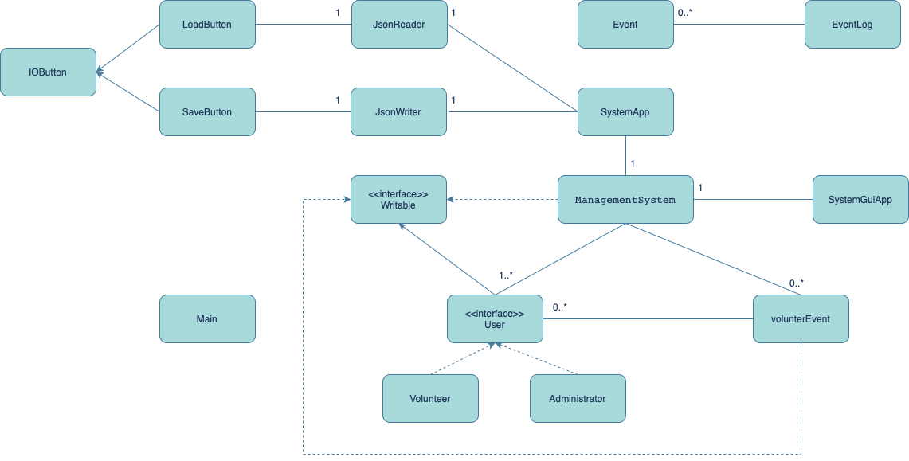

# Volunteer Management System

## This system is designed for NPOs (*non-profit organizations*) to arrange their volunteer spots. For example, Assign a volunteer to a specific job at a specific program or volunteerEvent.
## Users will include *volunteers* and *administrators*
## I am working for an organization that designs software solutions for NPOs. We found some NPOs are still using paper&pens and then manually input the volunteer data into spreadsheets. Also, they lack effective communication tools other than E-mail. 


**User Story**:

(*phase 0*)
- *As an **administrator**, I want to be able to create an volunteerEvent amd add it to the VMSystem*
- *As an **administrator**, I want to be able to assign volunteers to an volunteerEvent*
- *As a **volunteer**, I want to sign up for the volunteer list*
- *As a **volunteer**, I want to see the volunteerEvent list and which volunteerEvent I am assigned*

(*phase 2*)
- *As a **user**, I want to be able to save my data after I close the app*
- *As a **user**, I want to be able to load my data when I open the app again*

# Instructions for Grader:

## As an administrator:
- To login as an administrator
    1. Enter the credentials at the top
        -Default username: "admin"
    2. Click on the "login" button
- To create an volunteerEvent
    1. Enter the volunteerEvent name
    2. Enter the number of volunteers needed
    3. Click on the "Create Event" button
- To assign volunteers to an volunteerEvent
    1. Select an volunteerEvent from the volunteerEvent list
    2. Select a volunteer from the volunteer list
    3. Click on the "Assign" button
- To exit the app
    1. Enter the command "exit" at the top
    2. Click on the "login" button

## As a volunteer:
- if you are a new volunteer
    1. Enter your name
    2. Click on the "Sign Up" button
    3. A pop-up window will show up to confirm your name
    4. Click on the "X" button to close the pop-up window
- if you are an existing volunteer
    1. Enter your name
    2. Click on the "Sign Up" button
    3. A pop-up window will show up to show wht events you are assigned to

## To save and load data:
- To save data
    - Click on the "Save" button
- To load data
    - Click on the "Load" button

PHASE 4:

Task 2 Sample:<br>
```
Tue Nov 28 22:31:11 PST 2023
Created a volunteer: Arthur
Tue Nov 28 22:31:22 PST 2023
Created a volunteer: Ronney
Tue Nov 28 22:31:28 PST 2023
Created an event: E1 needing: 2 volunteers
Tue Nov 28 22:31:30 PST 2023
Added a volunteer: Arthur to E1
Tue Nov 28 22:31:34 PST 2023
Added a volunteer: Ronney to E1
Tue Nov 28 22:31:43 PST 2023
Created an event: E2 needing: 3 volunteers
Tue Nov 28 22:31:45 PST 2023
Created a volunteer: Caitlin
Tue Nov 28 22:31:52 PST 2023
Added a volunteer: Arthur to E2
Tue Nov 28 22:31:55 PST 2023
Added a volunteer: Caitlin to E2
Tue Nov 28 22:31:57 PST 2023
Added a volunteer: Ronney to E2
Tue Nov 28 22:32:01 PST 2023
Saving data to ./data/save.json
Tue Nov 28 22:32:03 PST 2023
Event log cleared.
```


Task 3:


Refactor:
I will make a composite pattern for the user class, where admin and volunteers are users. 
In this case, user is the component interface, admin is the composite, and volunteer is the leaf. 
I will also let users have a list of events, which for admin, it will be the events that they created, and for volunteers, it will be the events that they are assigned to.
In this structure, I can remove the system class, and simplify the structure of the program.
Also, it will reduce the duplicate code in the system class, since the admin and volunteer class will have their own methods to create events and assign volunteers.
This is a better way to write readable code since each class will have methods like real-world behaviors.